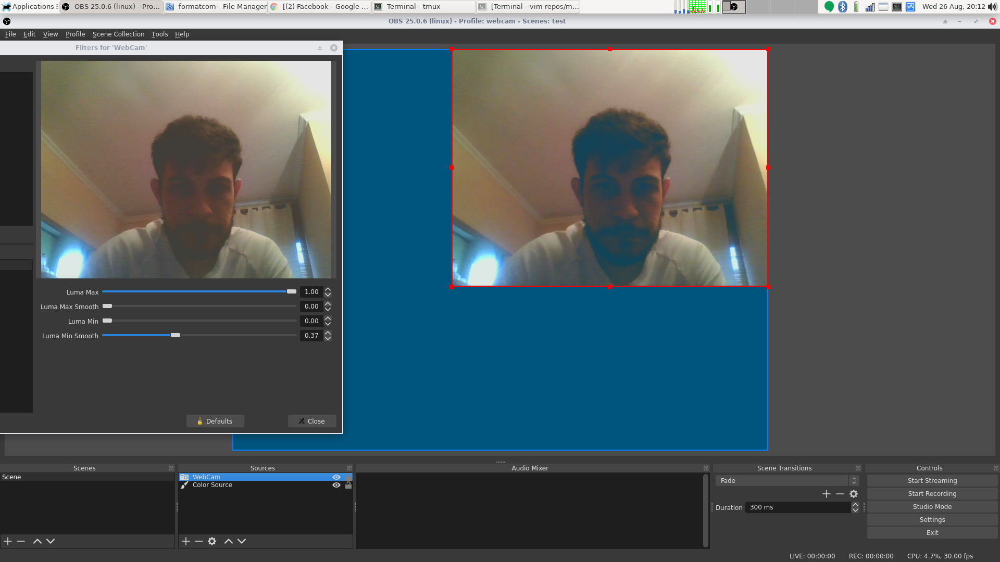

### documentación oficial

- https://ffmpeg.org/ffmpeg-all.html
- https://ffmpeg.org/ffmpeg-devices.html#lavfi
- https://trac.ffmpeg.org/wiki/HWAccelIntro
- https://trac.ffmpeg.org/wiki/Hardware/VAAPI
- https://trac.ffmpeg.org/wiki/Hardware/QuickSync

~~~
$ ffmpeg [global_options] {[input_file_options] -i input_url} ... \
	{[output_file_options] output_url} ...
~~~

~~~
 _______              ______________

|       |            |              |
| input |  demuxer   | encoded data |   decoder
| file  | ---------> | packets      | -----+
|_______|            |______________|      |
                                           v
                                       _________
                                      |         |
                                      | decoded |
                                      | frames  |
                                      |_________|
 ________             ______________       |
|        |           |              |      |
| output | <-------- | encoded data | <----+
| file   |   muxer   | packets      |   encoder
|________|           |______________|

~~~

### Complex filtergraphs

~~~
 _________
|         |
| input 0 |\                    __________
|_________| \                  |          |
             \   _________    /| output 0 |
              \ |         |  / |__________|
 _________     \| complex | /
|         |     |         |/
| input 1 |---->| filter  |\
|_________|     |         | \   __________
               /| graph   |  \ |          |
              / |         |   \| output 1 |
 _________   /  |_________|    |__________|
|         | /
| input 2 |/
|_________|

~~~

### overlay

~~~
El overlay filtro requiere exactamente dos entradas de    video,
pero ninguna está especificada, por lo que se utilizan las dos
primeras secuencias de video disponibles
~~~

### listar dispositivos

~~~
$ v4l2-ctl --list-devices
$ v4l2-ctl -d /dev/video3 --list-formats-ext
~~~

### ver decodes habilitados

~~~
$ ffmpeg -decoders
~~~

### ver decodes habilitados

~~~
$ ffmpeg -encoders
$ ffmpeg -h encoder=h264_qsv
~~~

### capturar con el cpu

~~~
$ ffmpeg -f alsa  -i hw:1    -f v4l2 \
	-framerate 60 -video_size 1920x1080 -input_format mjpeg \
	-i /dev/video5 -vcodec copy output.mkv

$ ffmpeg -f pulse -i default -f v4l2 \
	-framerate 60 -video_size 1920x1080 -input_format mjpeg \
	-i /dev/video5 -vcodec copy output.mkv
~~~

### ffmpeg | pulse sources

~~~
NOTA: para pulse se puede utilizar la entrada por defecto, o utilizar cualquiera
que este en la lista de dispositivos de entrara la cual podemos obtener con este
comando.

$ pactl list sources | grep Name
~~~

### alsa mixer

~~~
$ alsamixer
~~~

### jack para control de audio

~~~
$ pactl list
$ pactl list sink
$ pactl list source

$ pactl load-module   module-jack-sink
$ pactl unload-module module-jack-sink

$ pactl load-module   module-jack-source
$ pactl unload-module module-jack-source

$ cat /proc/asound/cards
$ alsa_in -j 'Console Source' -d hw:1
~~~

### loopback audio

~~~
$ pactl load-module   module-loopback
$ pactl unload-module module-loopback
~~~

### device null (para utilizarlo como entrada virtual)

~~~
$ pactl load-module module-null-sink \
	sink_name=Console sink_properties=device.description="Console"

$ pactl load-module module-loopback latency_msec=1 sink=Console
~~~

~~~
NOTA: se puede asignar al inicio al inicio del sistema desde
el archivo /etc/pulse/default.pa

El module-loopback solo me ha funcionado como lo espero si lo asigno
manualmente, de lo contrario no se asigna a la entrada virtual.
~~~

### loopback video
~~~
$ sudo modprobe v4l2loopback
~~~

### intel Quick Sync va-api

- intel /dev/dri/renderD128
- amd   /dev/dri/renderD129

~~~
$ ffmpeg -vaapi_device /dev/dri/renderD128 -video_size 1280x720 \
	-i /dev/video5 -filter_complex format=nv12,hwupload 
	-vcodec h264_vaapi output.mkv
~~~

### intel Quick Sync qsv

~~~
$ ffmpeg -y -f alsa -i hw:1 -init_hw_device qsv=hw -filter_hw_device hw     \
	-f v4l2 -i /dev/video5 -filter_complex hwupload=extra_hw_frames=64  \
	-vcodec h264_qsv -global_quality 15 -preset 7 -profile high output.mkv
~~~

### Configuración utilizada

~~~
$ ffmpeg -y -f alsa -i hw:1 -init_hw_device qsv=hw -filter_hw_device hw \
	-f v4l2 -i /dev/video5 -f v4l2 -i /dev/video3                   \
	-filter_complex overlay=1590:10,hwupload=extra_hw_frames=64     \
	-vcodec h264_qsv -global_quality 15 -preset 7 -profile high output.mp4

NOTA: extra_hw_frames=64 <- el valor no me queda claro su función
~~~

### ip webcam
~~~
$ gst-launch-1.0 souphttpsrc location="http://192.168.0.11:8080/video" \
	is_live=true ! jpegdec ! autovideosink

$ gst-launch-1.0 souphttpsrc location="http://192.168.0.11:8080/video" \
	is_live=true ! jpegdec ! videoconvert ! v4l2sink device=/dev/video1
~~~

### test filter
~~~
$ ffmpeg -y -f v4l2 -s 640x480 -i /dev/video3 \
	-f lavfi -i color=gray:s=640x480 \
	-f lavfi -i color=white:s=640x480 \
	-f lavfi -i color=black:s=640x480 \
	-f alsa -i hw:0 -filter_complex "[0:0][1:0][3:0][0:0]threshold" output.mp4
~~~

~~~
$ ffmpeg -y -f v4l2 -s 1920x1080 \
	-i /dev/video5 \
	-i /dev/video3 \
	-f lavfi -i color=gray:s=640x480 \
	-f lavfi -i color=white:s=640x480 \
	-f lavfi -i color=black:s=640x480 \
	-f v4l2 -f alsa -i hw:1 \
	-filter_complex "
		[1:v][2:v][4:v][1:v]threshold[cout],
		[cout]colorkey=black:0.5:0.9[out],
		[0:v][out]overlay=10:10" output.mp4
~~~

### transmitir video a un lookback para evitar el limite de conexiones ( device busy )

~~~
$ ffmpeg -y -f v4l2 -s 640x480 -i /dev/video3 \
	-pix_fmt yuyv422 -f v4l2 /dev/video0
~~~

### con filtro

~~~
$ ffmpeg -y -f v4l2 -s 640x480 -i /dev/video3 \
	-f lavfi -i color=gray:s=1280x720 \
	-f lavfi -i color=white:s=1280x720 \
	-f lavfi -i color=black:s=1280x720 \
	-filter_complex "[0:v][1:v][3:v][0:v]threshold, scale=320:180" \
	-pix_fmt yuyv422 -f v4l2 /dev/video0
~~~

### ver resultado

~~~
$ ffplay /dev/video0
~~~

### setup que estoy utilizando actualmente

~~~
  Para la webcam estoy utilizando un truco inspirado en la pantalla verde,
y trabajando ayudandome con obs para tener un preview y crear la gui.
~~~

- lienzo 640x480 color #00557f
- webcam 368x284 con un filtro luma
- la salida la retransmito por v4l2 a 30 fps ( driver de video linux ) a /dev/video0

~~~
  Para la captura de video que es la parte mas importante en cuanto a calidad y
rendiento lo hago ffmpeg con qsv para alcanzar alto rendiento y mucha calidad
con pocos recursos.
~~~

~~~
$ ffmpeg -y -f alsa -i hw:0 -f alsa -i hw:1 \
	-init_hw_device qsv=hw -filter_hw_device hw \
	-f v4l2  -i /dev/video5 \
	-f v4l2 -i /dev/video0 \
	-filter_complex "
		[0:a][1:a]amix=inputs=2;
		[3:v]colorkey=#00557f:0.2:0.4[cout],
		[2:v][cout]overlay=1270:10,
		hwupload=extra_hw_frames=4, format=qsv"
		-vcodec h264_qsv -b:v 15M -global_quality 15 output.mp4
~~~

~~~
NOTA: el volumen lo estoy controlando directamente desde pulse (driver de audio),
pero estoy trabajando para tener una mejor calidad de sonido.
~~~
